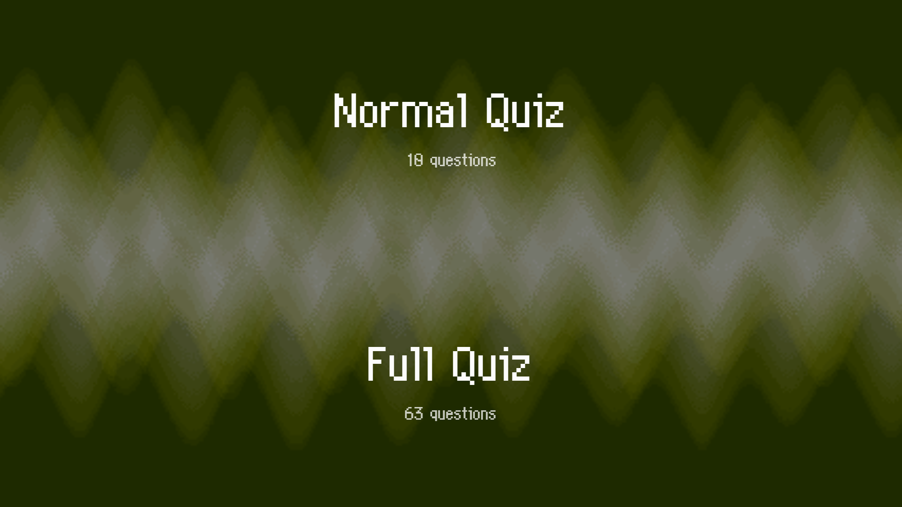
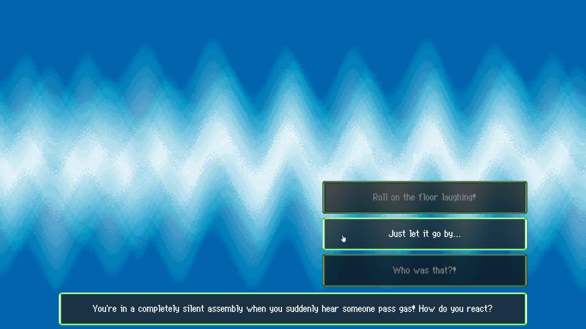
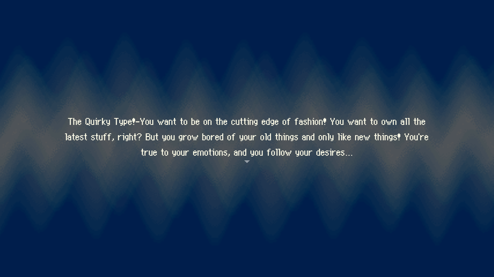
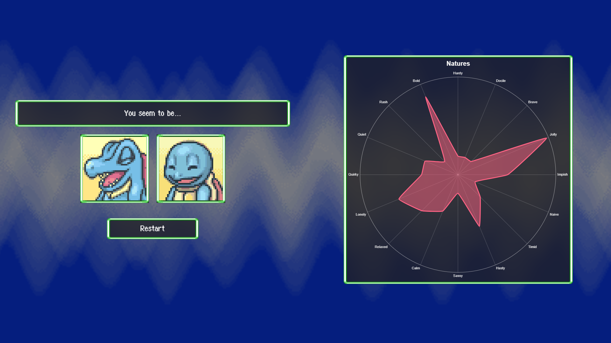

# Pokemon Mystery Dungeon Personality Quiz Online

## About

PMD quiz online is a litte project I did in my spare time because I love PMD and I always wanted to do this. I did it once in Unity but I didn't like the result so I decided to do it again in HTML5 using Svelte, TailwindCss and Vite as a bundler. 

I have no idea of what I'm doing, I'm not a web developer, this is my second frontend project (the first one was a simple sign up form to get used to this).

Code is kind of a mess, it works, there are no bugs (that I know) and it works fine. If you want to check the code of this repo as inspiration... Please don't, give me sometime to clean it up.

## Features

- Spanish and English support (auto detect)
- The 63 original questions and natures descriptions
- Original sprites, sounds and music
- Almost identical aesthetic to the original game
- Natures radar chart (NEW)
- Two modes (Normal Quiz and Full Quiz)
- Fully responsive

## Images

|                                           |                                           |
|-------------------------------------------|-------------------------------------------|
|  |  |
|  |  |

## Assets used

I tried using the original assets ripped from the game to be as faithful as possible to the game while still adapting it a little to fit these times.

Althought not all assets are mine, here are the sources:

- [Font](https://www.dafont.com/es/wonder-mail.font)
- [Questions and Natures [ES]](https://www.wikidex.net/wiki/Test_de_personalidad_de_Pokémon_Mundo_misterioso:_Exploradores_del_cielo)
- [Questions [EN] (ripped from html)](https://explorerofsky.github.io/pmd-sky-quiz/)
  - Sorry, your site was the only one well formatted enough to be ripped easily, I asked you for permission but you didn't read me :(
- [Natures [EN]](https://www.deviantart.com/sparklespeed/journal/Pokemon-Mystery-Dungeon-EoS-Nature-Descriptions-439788647)
- Sprites were ripped from the game
- Sounds were ripped from the game
- Music was ripped from the game
- [Background sprite](https://discord.com/channels/710190644152369162/1029472133073604708/1035347628025716816)
  - These were thanks to Palika on SkyTemple Discord. I modified them to make the transition in the browser seamless.

Update:
 - [Question point data is now taken from PMD Info Spreadsheet](https://docs.google.com/spreadsheets/d/18utO_lCpWQ7iXY9wpbtxXpgmzebEI2IRjADp6IrUKZ0/view#gid=422133115)
   - Thanks [UserNameFolder](https://www.reddit.com/r/MysteryDungeon/comments/ylgmf5/comment/iuyhfdr/?utm_source=share&utm_medium=web2x&context=3) for pointing it out ^^